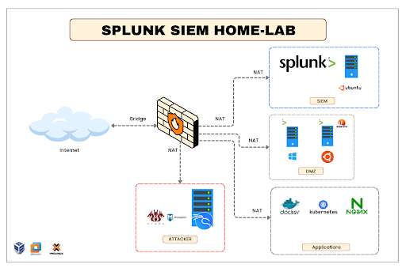

# Splunk SIEM Home-Lab 🛡️

## 📝 Descripción
Proyecto de despliegue de un entorno SOC (Security Operations Center) doméstico para el monitoreo de amenazas, análisis de telemetría y detección de intrusiones. El objetivo es centralizar logs de múltiples fuentes para identificar vectores de ataque mediante el uso de herramientas de grado empresarial.

## 🏗️ Arquitectura del Laboratorio

### Componentes:
* **Firewall/IDS:** OPNsense (Segmentación de redes WAN/SOC/DMZ y detección vía Suricata).
* **SIEM:** Splunk Enterprise corriendo en Ubuntu Server.
* **Endpoint (Víctima):** Windows Server 2022 con Sysmon y Splunk Forwarder.
* **Atacante:** Kali Linux (Metasploit, Nmap).

---

## 🚀 Fase 1: Despliegue de Infraestructura

### 1.1 Instalación de Windows Server 2022 (Target)
Se realizó la instalación base de Windows Server en el segmento DMZ. Este servidor actuará como el activo crítico a monitorear.

* **Descripción:** Confirmación de despliegue del sistema operativo. En esta etapa se configuró la IP estática y se preparó el entorno para la ingesta de telemetría.

### 1.2 Instalación y Configuración de OPNsense
Para la gestión perimetral, se optó por **OPNsense** debido a su robusto motor de IDS/IPS y estabilidad en entornos virtualizados.

* **Descripción:** Asignación de interfaces vía CLI. La interfaz `em0` se configuró como WAN para la salida segura a internet, mientras que `em1` se estableció como el Gateway de la zona LAN/SOC.

---

## 📊 Estado del Proyecto
- [x] Instalación de Windows Server 2022 (Endpoint).
- [x] Configuración inicial de OPNsense (Firewall).
- [ ] Configuración de segmentación LAN/DMZ en Firewall.
- [ ] Instalación de Splunk Enterprise en Ubuntu.
- [ ] Despliegue de Sysmon y Splunk Forwarder en la víctima.
- [ ] Simulación de ataques y creación de Dashboards.
