# Splunk SIEM Home-Lab 🛡️

## 📝 Descripción
Proyecto de despliegue de un entorno SOC (Security Operations Center) doméstico para el monitoreo de amenazas, análisis de telemetría y detección de intrusiones. El objetivo es centralizar logs de múltiples fuentes para identificar vectores de ataque mediante el uso de herramientas de grado empresarial.

## 🏗️ Arquitectura del Laboratorio

### Componentes:
* **Firewall/IDS:** OPNsense (Segmentación de redes WAN/SOC/DMZ y detección vía Suricata).
* **SIEM:** Splunk Enterprise corriendo en Ubuntu Server.
* **Endpoint (Víctima):** Windows Server 2022 con Sysmon y Splunk Forwarder.
* **Atacante:** Kali Linux (Metasploit, Nmap).

---

## 🚀 Fase 1: Despliegue de Infraestructura

### 1 Instalación de Windows Server 2022 (Target)
Se realizó la instalación base de Windows Server en el segmento DMZ. Este servidor actuará como el activo crítico a monitorear.

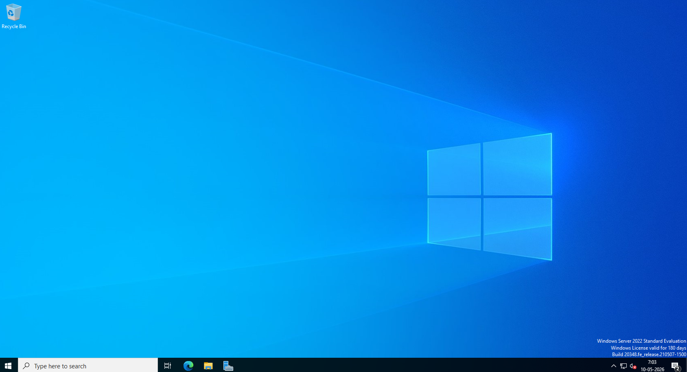
* **Descripción:** Confirmación de despliegue del sistema operativo. En esta etapa se configuró la IP estática y se preparó el entorno para la ingesta de telemetría.

### 2 Instalación y Configuración de OPNsense
Para la gestión perimetral, se optó por **OPNsense** debido a su robusto motor de IDS/IPS y estabilidad en entornos virtualizados.

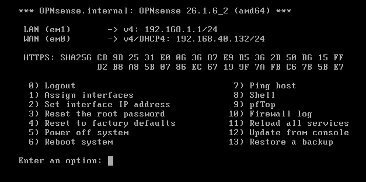
* **Descripción:** Asignación de interfaces vía CLI. La interfaz `em0` se configuró como WAN para la salida segura a internet, mientras que `em1` se estableció como el Gateway de la zona LAN/SOC.

### 2.1 Configuración Final de Red (Escenario Unificado)
Se ha validado la conectividad de las interfaces bajo un esquema de direccionamiento unificado para optimizar la visibilidad del IDS/IPS.

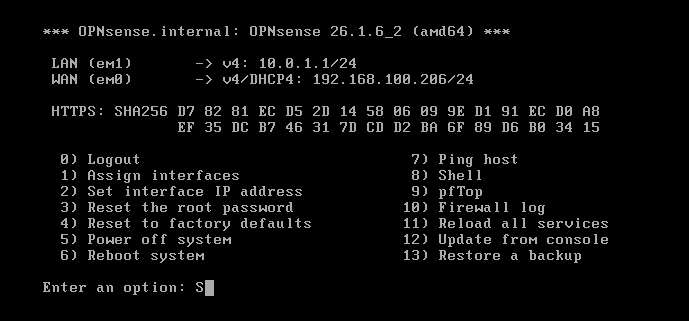

* **Interface WAN (em0):** 10.0.1.100/24.
* **Interface LAN (em1):** 10.0.1.122/24.
* **DNS:** Configurado a 8.8.8.8 para resolución de amenazas externas.
* **Resultado:** El firewall es accesible vía Web GUI y está listo para la implementación de Suricata y la exportación de logs hacia Splunk.
---
### 3 Ubuntu SIEM

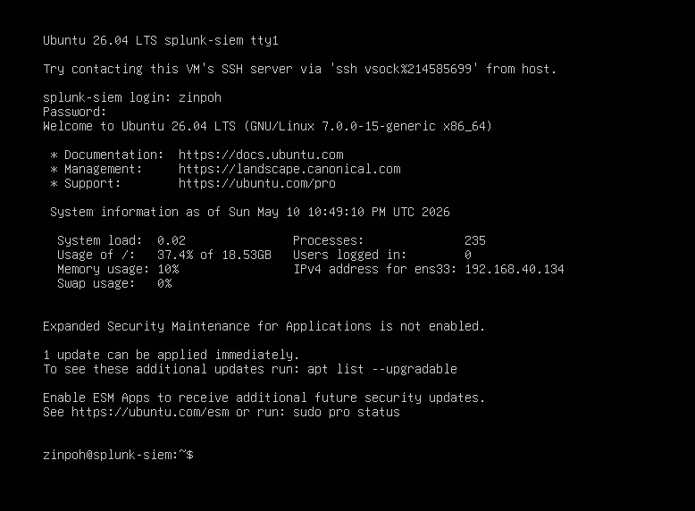

## Detalles de Configuracion
### 3.1 Configuración de Acceso Externo
Durante la fase de 'Proxy Configuration', se optó por omitir el uso de un proxy dedicado.
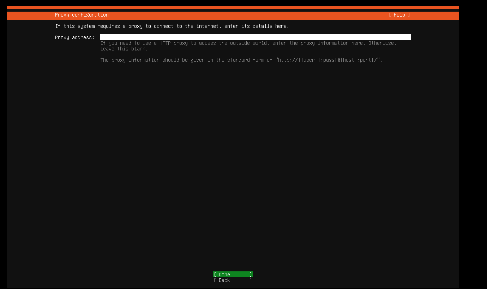

* **Decisión:** Salida directa vía Gateway (OPNsense).
* **Justificación:** Se busca simplificar la cadena de flujo de datos para la ingesta inicial de Splunk, delegando el control de tráfico y filtrado directamente al Firewall perimetral del laboratorio.

### 3.2 Validación de Repositorios
Se confirmó la salida a internet del servidor Ubuntu mediante la prueba de espejos (mirrors) oficiales.

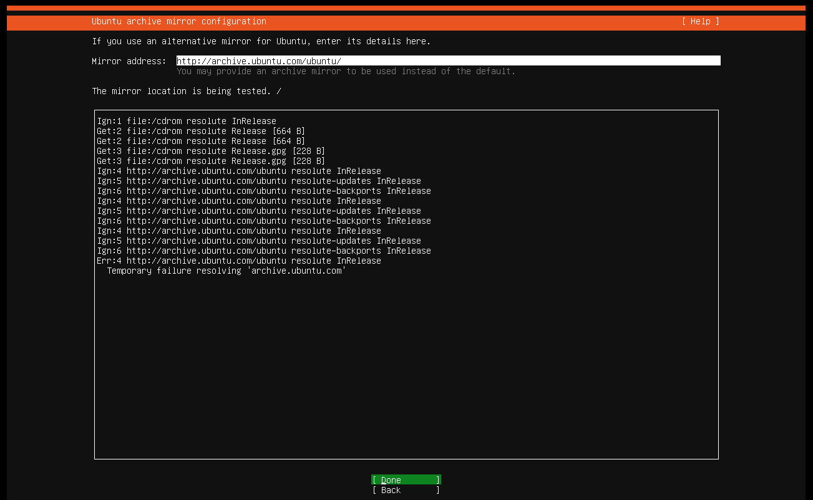

* **Estado:** Exitoso.
* **Gateway Operacional:** El tráfico de actualización está siendo ruteado correctamente a través de OPNsense (10.0.1.122).

### 4 Maquina Atacante Kali
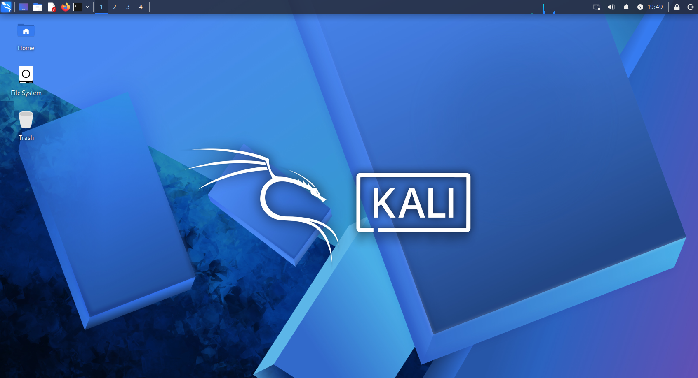

## Configurando maquinas desde OPNsense
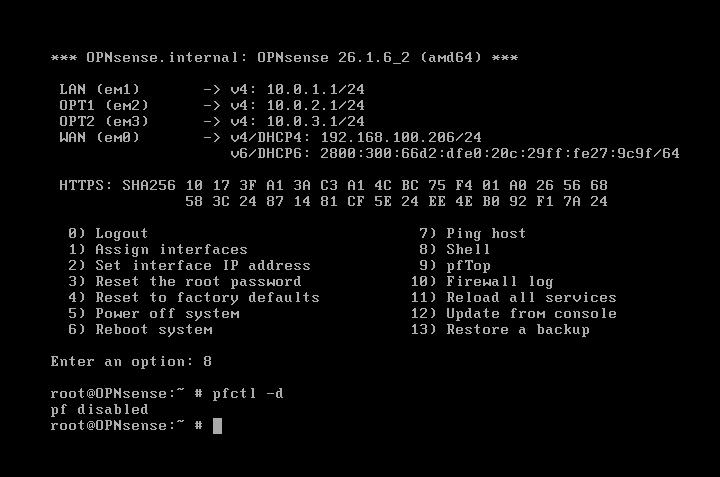

* **Configuracion:** A traves de opensense realizo la configuaración de las ip's de cada maquina

### Vista de configuracion de adaptadores de red con el rango ip por entorno
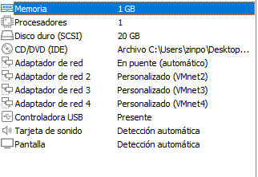
| red virtual especifica | maquina correspondiente | interfaz de OPNsense | red | desde (rango_ip) | hasta (rango_ip) |
| ---------------------- | ----------------------- | -------------------- | --- | ---------------- | ---------------- |
| VMnet2 | Ubuntu SIEM | em1 | 10.0.1.0/24 | 10.0.1.50 | 10.0.1.100 |
| VMnet3 | WinSRVR2022 | em2 | 10.0.2.0/24 | 10.0.2.50 | 10.0.2.100 |
| Vmnet4 | Kali atack | em3 | 10.0.3.0/24 | 10.0.3.50 | 10.0.3.100 |

### Configuracion en OPNsense
comando para desactivar temporalmente el bloqueo de la web GUI desde la WAN
```bash
pfctl -d
```
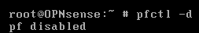

### A contnuación nos dirigimos a la ip de la wan: https://ip_wan
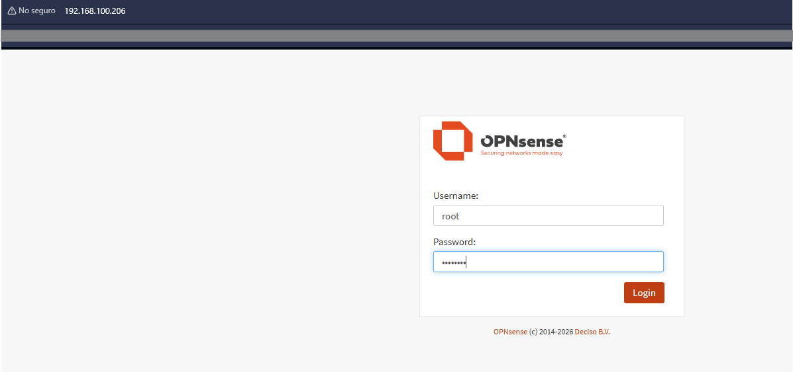
* **Navegador:** como en este caso el adptador del firewall hacia el internet utiliza bridge (puente), me permite utilizar mi dipositivo fisico

## Configuraciones de OPNsense
### 1. Disable HTTP Referential integrity check
Desde la pagina principal seleccionamos en la barra de navegacion lateral en **System**, luego en **Settings** y luego en **Administration**
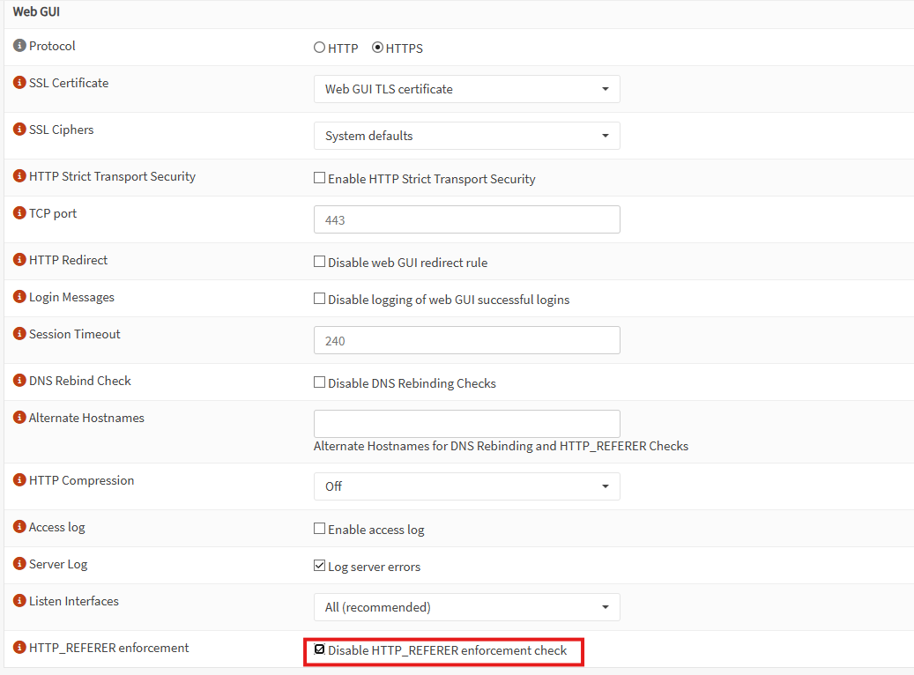
* **para que sirve?** Evita que el firewall me saque cuendo entre desde una IP (como la wan) quen él no reconoce como "segura" originalmente

### 2. Disable web GUI anti-lockout rule
en la misma pestaña de **System -> Settings -> Administration** para seleccionar la opcion **Disable web GUI redirect rule**
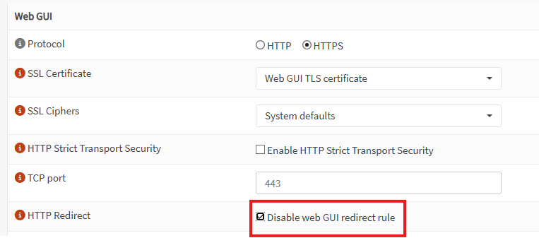
* **para que sirve?** para que el firewall no me bloquee si accidentalmente borre la regla de la Lan.

### 3. Interfaces
Configuraremos OPT1 y OPT2 les daremos en **"Enable"** y **"save"**
* esto nos permitira saber si OPNsense los reconoce
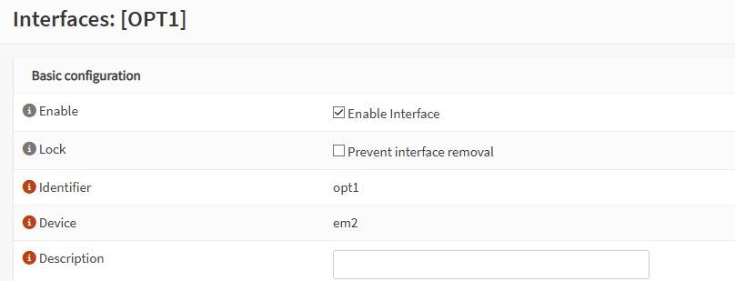
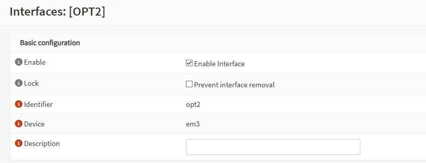


## 📊 Estado del Proyecto
- [x] Instalación de Windows Server 2022 (Endpoint).
- [x] Configuración inicial de OPNsense (Firewall).
- [x] Configuración de segmentación LAN/DMZ en Firewall.
- [x] Instalación de Splunk Enterprise en Ubuntu.
- [ ] Despliegue de Sysmon y Splunk Forwarder en la víctima.
- [ ] Simulación de ataques y creación de Dashboards.
